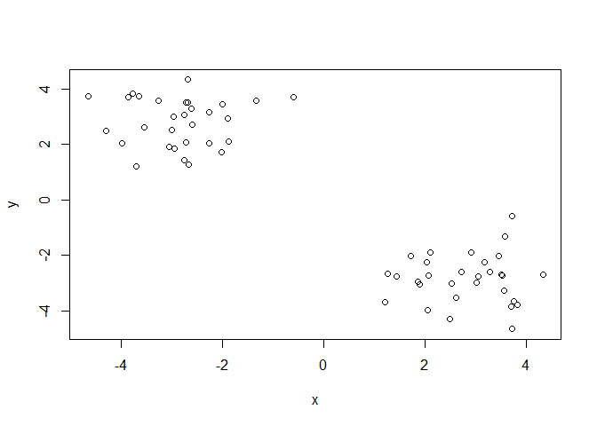
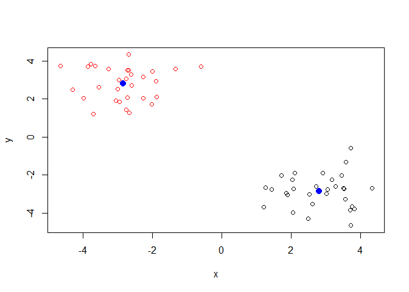
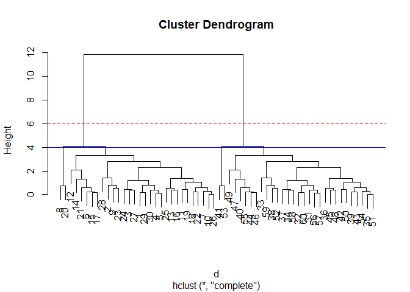
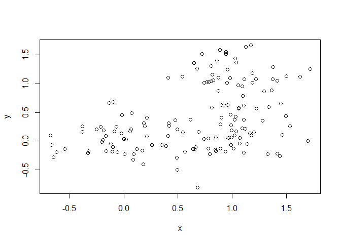
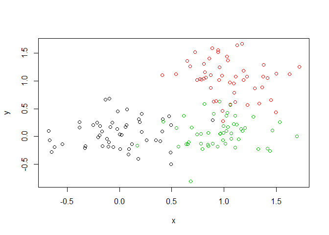
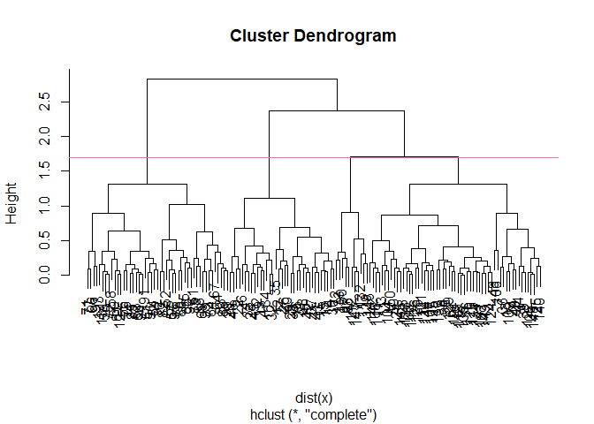
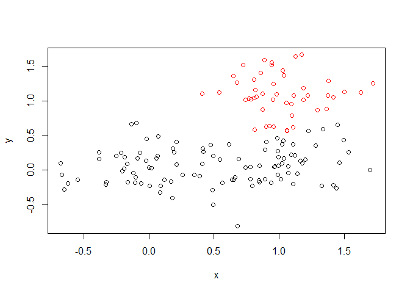
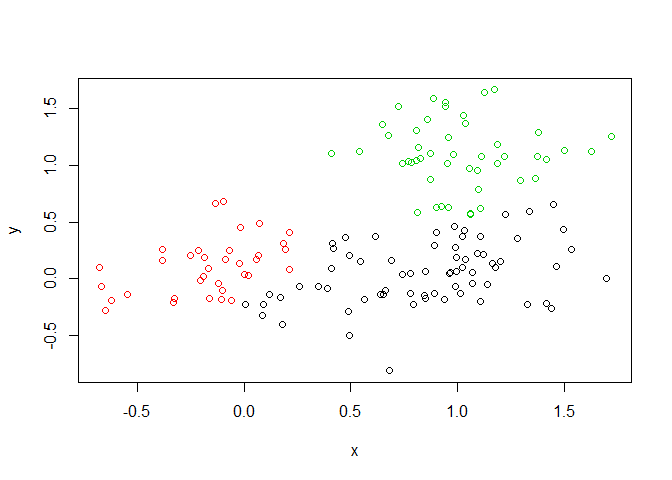
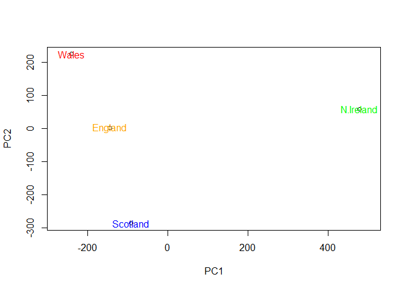
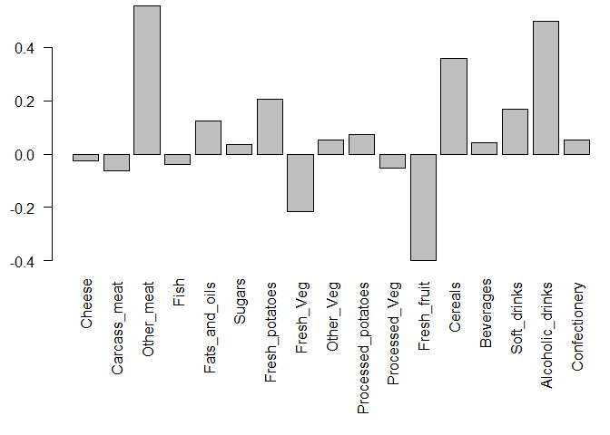

Class 9 Notes: Machine Learning and Clustering
================
Emily R. Paris
2/4/2020

# Clustering

**Function: ‘kmeans(x, centers = k, nstart = number of run times)’**
Best clustering is **smallest SS number**.

**1. K-Means Clustering:** You define ‘K’ number of clusters (ex. k = 3
for data from three types of cancer cells). R assigns ‘K’ groups as
which points are closest to the other. K-means keeps track of clusters
and their total **variance**, then starts again with three new intial
cluster points. Winning iteration is one with **smallest variation
value**.

**What if there’s more than 2 dimensions?** With ‘x’ and ‘y’, distance
is like distance formula for triangle. But, if we have more than 2
samples, algorithm works the same way. You can also plot the data with
points of different sizes and shades to show dimension.

**K-means always gives you number of K’s you request, even if a
different number would be better.**

**Scree Plot** is K vs Total wihtin SS (‘Sum of Squares’)–tries **range
of different K values**.

## Clustering Practice

``` r
# Generate some example data for clustering
# Note: the following two lines explain the coding below, but are only used to get make-believe data to behave like real data that would be clustered. You would not need to do this with real data.
# rnorm makes data a normal distribution, 30 points centered at -3, then 30 points centered at +3
# cbind combines R objects by row or by column, x = tmp and y = reverse of tmp --> makes 2-column structure

tmp <- c(rnorm(30,-3), rnorm(30,3))
x <- cbind(x=tmp, y=rev(tmp))
plot(x)
```

<!-- -->

``` r
km <- kmeans(x, centers = 2, nstart = 20)
km
```

    ## K-means clustering with 2 clusters of sizes 30, 30
    ## 
    ## Cluster means:
    ##           x         y
    ## 1  2.803549 -2.836666
    ## 2 -2.836666  2.803549
    ## 
    ## Clustering vector:
    ##  [1] 2 2 2 2 2 2 2 2 2 2 2 2 2 2 2 2 2 2 2 2 2 2 2 2 2 2 2 2 2 2 1 1 1 1 1 1 1 1
    ## [39] 1 1 1 1 1 1 1 1 1 1 1 1 1 1 1 1 1 1 1 1 1 1
    ## 
    ## Within cluster sum of squares by cluster:
    ## [1] 44.09996 44.09996
    ##  (between_SS / total_SS =  91.5 %)
    ## 
    ## Available components:
    ## 
    ## [1] "cluster"      "centers"      "totss"        "withinss"     "tot.withinss"
    ## [6] "betweenss"    "size"         "iter"         "ifault"

**Questions:**

**Q. How many points are in each cluster?**

30 points in each cluster (indicated by ‘sizes’)

**Q. What ‘component’ of your result object details…** Note: see outputs
available in ‘help’ or at botom of plot.

**- cluster size?**

``` r
# Outputs size of each cluster
km$size
```

    ## [1] 30 30

**- cluster assignment/membership?**

``` r
# Cluster Vector
km$cluster
```

    ##  [1] 2 2 2 2 2 2 2 2 2 2 2 2 2 2 2 2 2 2 2 2 2 2 2 2 2 2 2 2 2 2 1 1 1 1 1 1 1 1
    ## [39] 1 1 1 1 1 1 1 1 1 1 1 1 1 1 1 1 1 1 1 1 1 1

``` r
# Total number of points
length(km$cluster)
```

    ## [1] 60

``` r
# Breakdown among clusters
table(km$cluster)
```

    ## 
    ##  1  2 
    ## 30 30

**- cluster center?**

``` r
# Gives means of each cluster
km$centers
```

    ##           x         y
    ## 1  2.803549 -2.836666
    ## 2 -2.836666  2.803549

**Plot x colored by the kmeans cluster assignment and add cluster
centers as blue points.**

``` r
# Colors clusters with default color numbers
plot(x, col = km$cluster)

# col = color, pch = character size, cex = size and shape of center point
points(km$centers, col = "blue", pch = 20, cex = 2)
```

<!-- -->

### Hierarchical Clustering

Number of clusters is not known ahead of time, so each poit starts as
its own cluster and ends in one cluster. The main Hierarchical
Clustering function in R is called ‘hclust()’. An important point here
is that you have to calculate the distance matrix on your input data
before calling ‘hclust()’ (ie. you can’t just call ‘hclust(x)’).

``` r
# We will use our x from above...
d <- dist(x)
hc <- hclust(d)
hc
```

    ## 
    ## Call:
    ## hclust(d = d)
    ## 
    ## Cluster method   : complete 
    ## Distance         : euclidean 
    ## Number of objects: 60

``` r
# Note: Can also use hc <- hclust(dist(x))
```

View results of H clustering graphically. Note how the two main clusters
contain 30 points each (‘k’\!).

``` r
# Creates tree-like plot (dendogram) for closeness of cluster points. 'Abline' creates a horizontal line across tree. 
plot(hc)
abline(h = 6, col = "red", lty = 2)
abline(h = 4, col = "blue")
```

<!-- -->

To get cluster membership vector I need to “cut” the tree at a certain
height to yield my separate cluster branches.

``` r
cutree(hc, h = 6)
```

    ##  [1] 1 1 1 1 1 1 1 1 1 1 1 1 1 1 1 1 1 1 1 1 1 1 1 1 1 1 1 1 1 1 2 2 2 2 2 2 2 2
    ## [39] 2 2 2 2 2 2 2 2 2 2 2 2 2 2 2 2 2 2 2 2 2 2

``` r
cutree(hc, h=4)
```

    ##  [1] 1 1 1 1 1 1 1 2 1 1 1 1 1 1 1 1 1 1 1 2 1 1 1 1 1 1 1 1 1 1 3 3 3 3 3 3 3 3
    ## [39] 3 3 4 3 3 3 3 3 3 3 3 3 3 3 4 3 3 3 3 3 3 3

``` r
# Note: on this specific data, this height cuts the data into 4 clusters, so output will show various amounts of numbers 1-4 in relation to data points.
```

``` r
# Can cut into a specific number of groups too:
gp4 <- cutree(hc, k = 4)
gp4
```

    ##  [1] 1 1 1 1 1 1 1 2 1 1 1 1 1 1 1 1 1 1 1 2 1 1 1 1 1 1 1 1 1 1 3 3 3 3 3 3 3 3
    ## [39] 3 3 4 3 3 3 3 3 3 3 3 3 3 3 4 3 3 3 3 3 3 3

### Clustering with Data that is Close Together

**You can also cluster depending on certain characteristics.**

Single-link, Complete-link, Average-link as: **hc.single, hc.complete,
hc.average**

``` r
# Step 1. Generate some example data for clustering
x <- rbind(
 matrix(rnorm(100, mean=0, sd = 0.3), ncol = 2), # c1
 matrix(rnorm(100, mean = 1, sd = 0.3), ncol = 2), # c2
 matrix(c(rnorm(50, mean = 1, sd = 0.3), # c3
 rnorm(50, mean = 0, sd = 0.3)), ncol = 2))
colnames(x) <- c("x", "y")

# Step 2. Plot the data without clustering
plot(x)
```

<!-- -->

``` r
# Step 3. Generate colors for known clusters (just so we can compare to hclust results)
col <- as.factor( rep(c("c1","c2","c3"), each=50) )
plot(x, col=col)
```

<!-- -->

**Questions:**

**Q. Use the dist(), hclust(), plot() and cutree() functions to return 2
and 3 clusters**

``` r
hc <- hclust(dist(x))
plot(hc)
abline(h = 1.7, col ="hot pink")
```

<!-- -->

To get cluster membership vector use ‘cutree()’. To know how many
members of each cluster there are, use ‘table()’. Note that data must be
clustered wrong above becuase number of members in each cluster are not
equal (50:50:50).

``` r
grps <- cutree(hc, k = 2)
table(grps)
```

    ## grps
    ##   1   2 
    ## 103  47

``` r
plot(x, col = grps)
```

<!-- -->

``` r
grps <- cutree(hc, k = 3)
table(grps)
```

    ## grps
    ##  1  2  3 
    ## 68 35 47

``` r
plot(x, col = grps)
```

<!-- -->

**Q. How does this compare to your known ‘col’ groups?**

The points are not overlapping in k = 3. Note that colors may be
different due to randomness.

#### Principal Component Analysis (PCA)

**Patterns and Visualization**

Example 1. Identifying different human cells types in a cluster –\>
sequence mRNA; different cells with different genes…now we have data\!
We could plot this data in two dimensions and see that they’re inversely
related, but becomes trickier with more than 2 cell types…

**Use PCA\!** Can now cluster based on different cell types.

**PC’s are ranked by their importance.**

Separation horizontally is more significant than vertically. Ie. spread
observed involving PC1 is more important than spread involving PC2, etc.

New axis is called **PCs** or **Eigenvectors**, and **Eigenvalues**. PC1
and PC2 give scale of ‘spread’ with a goal of **finding a ‘better’ axis
for our data**.

##### PCA Practice with UK Foods Data

``` r
# Read the data using read.csv, take away variable in header over food types using row.names = 1.
x <- read.csv("UK_foods.csv", row.names = 1)
x
```

    ##                     England Wales Scotland N.Ireland
    ## Cheese                  105   103      103        66
    ## Carcass_meat            245   227      242       267
    ## Other_meat              685   803      750       586
    ## Fish                    147   160      122        93
    ## Fats_and_oils           193   235      184       209
    ## Sugars                  156   175      147       139
    ## Fresh_potatoes          720   874      566      1033
    ## Fresh_Veg               253   265      171       143
    ## Other_Veg               488   570      418       355
    ## Processed_potatoes      198   203      220       187
    ## Processed_Veg           360   365      337       334
    ## Fresh_fruit            1102  1137      957       674
    ## Cereals                1472  1582     1462      1494
    ## Beverages                57    73       53        47
    ## Soft_drinks            1374  1256     1572      1506
    ## Alcoholic_drinks        375   475      458       135
    ## Confectionery            54    64       62        41

**Q1. How many rows and columns are in your new data frame named x? What
R functions could you use to answer this questions?**

``` r
nrow(x)
```

    ## [1] 17

``` r
ncol(x)
```

    ## [1] 4

**Let’s make some plots to explore our data a bit more:**

``` r
barplot(as.matrix(x), beside=T, col=rainbow(nrow(x)))
```

<!-- -->

``` r
# Beside = T is side-by-side, Beside = F is stacked
```

**Let’s try a Pairs Plot.**

``` r
pairs(x, col=rainbow(10), pch=16)
```

<!-- --> **Q5:
Generating all pairwise plots may help somewhat. Can you make sense of
the following code and resulting figure? What does it mean if a given
point lies on the diagonal for a given plot?**

Plots one data set on x and one on y (ex. England = x, Whales = y on top
left plot). Each color point is a food type. Points not on diagonal show
that those data points are different between those two counntries.
Obviously not the most efficient or intuitive way to look at data.

**Let’s try PCA and component analysis now\!** Use the prcomp()
function.

``` r
# Use the prcomp() PCA function. t takes the transpose, rotating data because data originally inputed in a table (know to do this because of 'help' function).

pca <- prcomp( t(x) )
pca
```

    ## Standard deviations (1, .., p=4):
    ## [1] 3.241502e+02 2.127478e+02 7.387622e+01 4.188568e-14
    ## 
    ## Rotation (n x k) = (17 x 4):
    ##                              PC1          PC2         PC3          PC4
    ## Cheese              -0.056955380 -0.016012850 -0.02394295 -0.691718038
    ## Carcass_meat         0.047927628 -0.013915823 -0.06367111  0.635384915
    ## Other_meat          -0.258916658  0.015331138  0.55384854  0.198175921
    ## Fish                -0.084414983  0.050754947 -0.03906481 -0.015824630
    ## Fats_and_oils       -0.005193623  0.095388656  0.12522257  0.052347444
    ## Sugars              -0.037620983  0.043021699  0.03605745  0.014481347
    ## Fresh_potatoes       0.401402060  0.715017078  0.20668248 -0.151706089
    ## Fresh_Veg           -0.151849942  0.144900268 -0.21382237  0.056182433
    ## Other_Veg           -0.243593729  0.225450923  0.05332841 -0.080722623
    ## Processed_potatoes  -0.026886233 -0.042850761  0.07364902 -0.022618707
    ## Processed_Veg       -0.036488269  0.045451802 -0.05289191  0.009235001
    ## Fresh_fruit         -0.632640898  0.177740743 -0.40012865 -0.021899087
    ## Cereals             -0.047702858  0.212599678  0.35884921  0.084667257
    ## Beverages           -0.026187756  0.030560542  0.04135860 -0.011880823
    ## Soft_drinks          0.232244140 -0.555124311  0.16942648 -0.144367046
    ## Alcoholic_drinks    -0.463968168 -0.113536523  0.49858320 -0.115797605
    ## Confectionery       -0.029650201 -0.005949921  0.05232164 -0.003695024

``` r
summary(pca)
```

    ## Importance of components:
    ##                             PC1      PC2      PC3       PC4
    ## Standard deviation     324.1502 212.7478 73.87622 4.189e-14
    ## Proportion of Variance   0.6744   0.2905  0.03503 0.000e+00
    ## Cumulative Proportion    0.6744   0.9650  1.00000 1.000e+00

``` r
# Write about it in results: "PC1 accounts for 67% of variance, etc."
```

**What is in my result object ‘pca’? I cna check the attributes…**

``` r
attributes(pca)
```

    ## $names
    ## [1] "sdev"     "rotation" "center"   "scale"    "x"       
    ## 
    ## $class
    ## [1] "prcomp"

``` r
# PC1 vs PC2 plot.
plot(pca$x[,1], pca$x[,2], xlab="PC1", ylab="PC2", xlim=c(-270,500))

text(pca$x[,1], pca$x[,2], colnames(x), col=c("orange", "red", "blue", "green"))
```

<!-- -->

**Which food variable contributes to PCA the most?**

``` r
# Lets focus on PC1 as it accounts for > 90% of variance 
par(mar=c(10, 3, 0.35, 0))
barplot( pca$rotation[,1], las=2 )
```

<!-- -->

``` r
#PC2
par(mar=c(10, 3, 0.35, 0))
barplot( pca$rotation[,2], las=2 )
```

<!-- -->

``` r
#PC3
par(mar=c(10, 3, 0.35, 0))
barplot( pca$rotation[,3], las=2 )
```

<!-- -->

Note: “Maximum variance” = spread
